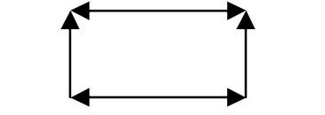
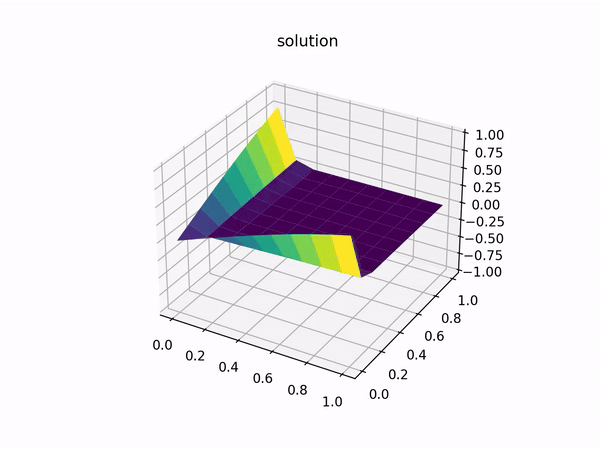
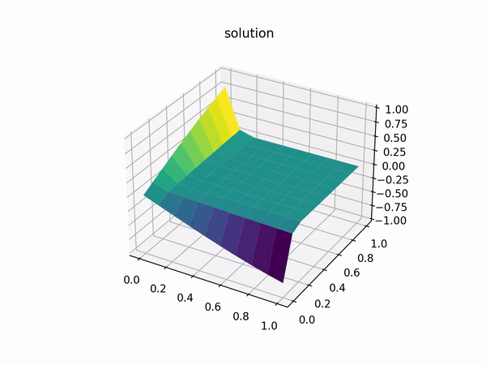

## MPI. Convection Equation.

### Objective

Convection eqauation has the following appearance:

$$ \frac{\partial\phi}{\partial t} + \nabla \vec F = 0 $$

$$ \vec F = \vec u * \phi $$

where F is simply a vector flow of $\phi$ quantity.

I recieve solution with border conditions:

$$ \phi = \phi(t, x, y) $$

$$ \phi(t, 0, y) = \phi_{x}(t, y) $$

$$ \phi(t, x, 0) = \phi_{y}(t, x) $$

### Evaluation scheme

Currently two explicit defference schemes are implemented:

1. left-triangle.


2. three points, centered.


3. four points, squared.



### API

#### Specify input

In mpi/src directory find equation.cpp file. It looks similar to this:

```c
float phi_x0(float time, float x) {
    float omega = 1;
    return sin(x) * cos(omega * time);
}

float phi_y0(float time, float y) {
    float omega = 1;
    return sin(y) * cos(omega * time);
}

float u_x (float time, float x, float y) {
    return 1;
}

float u_y(float time, float x, float y) {
    return 1;
}
```

Be free to define your OWN $\phi_{x}, \phi_{y}$ and velocity vector of convection:

$$ \vec u = (u_{x}, \space u_{y}) $$

#### Build

```bash
    mkdir build && cd build
    cmake ../ -DCMAKE_CXX_COMPILER=mpic++_path -DCMAKE_C_COMPILER=mpic_path
    camke --build ./
```

#### Run

In build/ directory you will see executable files. To run them simply type:

```bash
    mpirun ./triangle 10 0.1 dump_path
    mpirun ./centered 10 0.1 dump_path
    ./consequent 10 0.1 dump_path
```

argv[1] - field size of argv[1] x argv[1]

argv[2] - dx and dy step

On the output you recive your solution in dump_path file you specified and evaluation time in seconds (used to compare consequent vs parallel execution time)

#### Visulize

It's sometimes complecated to verify correctness of recieved solution. To check everythig worked out fine, type:

```bash
python build_plots.py path_to_dump
```

And be satisfied by beautiful 3D plots animated solution!!!

### Results

#### Plots

TA-DA:


#### MPI vs Consequent

Finaly reach approximately 1.5 times speed up on 1000x1000 field, when evaluate solution with MPI on 8 cores compared to consequent evaluation. The potential speed up can be reached only when decreasing number of send/recv function calls with reaspective to number of gradient evaluation.

### UPDATE (21.04)
New evaluation scheme was implemented. Namely four points-squared. When testing on previous border conditions recieved solution as follows:



We can see, that for every point $x = y$ following is true: $$\phi(t) = 0$$

Its only because the scheme is symetrical as border conditions to the line $y = x$. I changed border conditions:

$$\tilde{\phi}(x, t) = \phi(x, t)$$
$$\tilde{\phi}(y, t) = - \phi(y, t)$$

And recieved $\phi \in \mathbb{C}^2$ solution:


